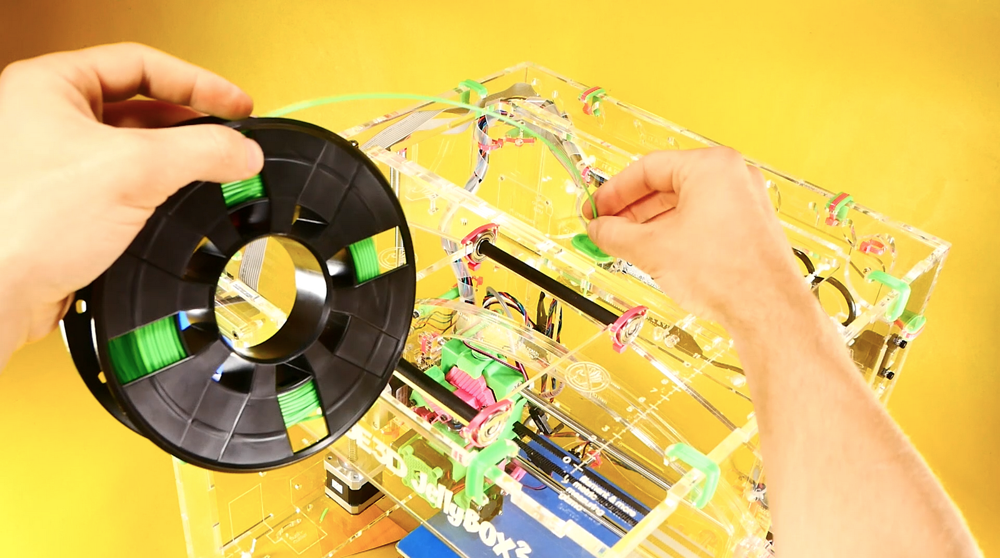
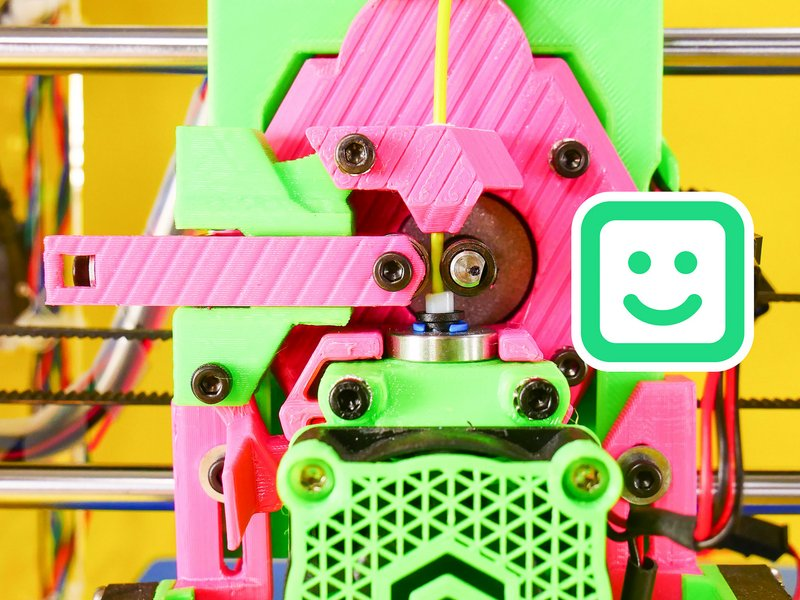
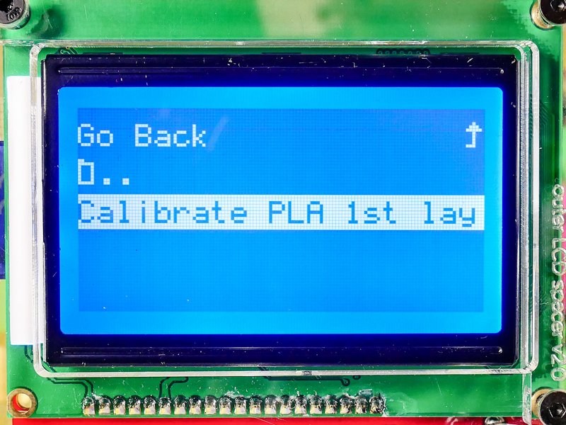
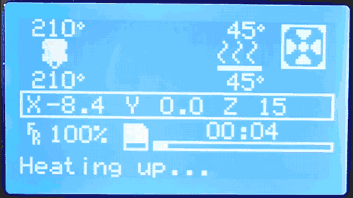
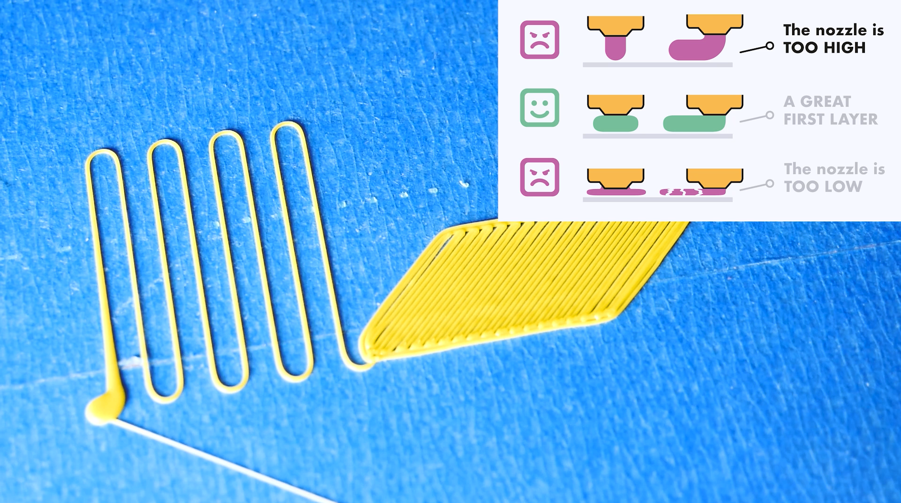
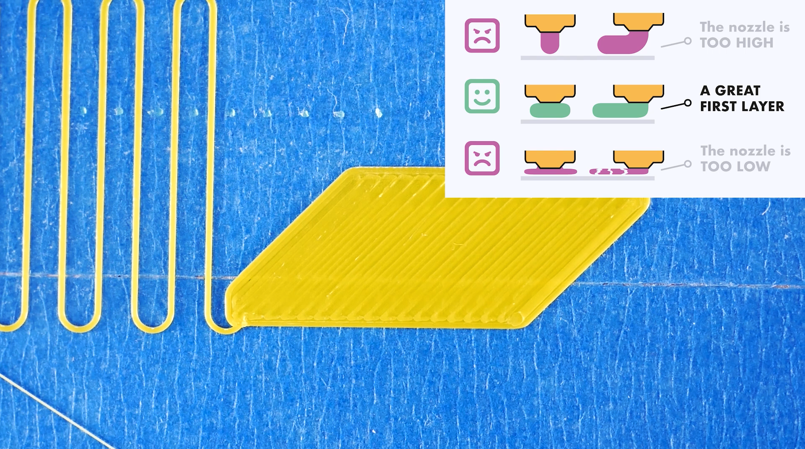
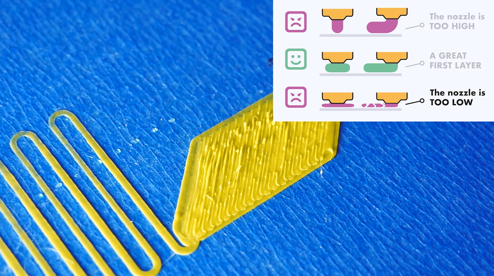

# Calibrate the First Layer Height
_In the previous section, we positioned the Z probe so that it senses the build plate before the nozzle hits it. Trouble is, the [nozzle is now too high](nozzle-too-high.md) for printing. We need to precisely bring it closer to the build plate._

## 🎥 Video Walkthrough (4 min with narration)

    <!-- Copy & Pasted from YouTube -->
    <iframe width="560" height="315" src="https://www.youtube-nocookie.com/embed/utCk_CkYjc8?rel=0" frameborder="0" allow="accelerometer; autoplay; encrypted-media; gyroscope; picture-in-picture" allowfullscreen></iframe>

- Your JellyBOX will preheat a bit, perform auto bed leveling sequence, and then pause and pre-heat to the final print temperatures.
- When it's ready to go, it will beep. At this point, press the encoder knob to actually start printing.
- While it's printing, use the Live Adjust Z Height function to adjust the first layer height to your liking.
- You inspect the resulting 1st layer and repeat as needed.

## The Elusive Perfect 1st Layer :id=perfect_1st

?> The **Perfect First Layer** is moderately squished with no visible gaps between parallel lines.

😡 If the nozzle is **too high**, the filament will not stick and your object will peel off or warp.

🤗 If the nozzle is **just right**, the filament will stick to the build plate, and the object will not be too difficult to remove once finished.

😡 If the nozzle is **too low**, the filament will not be able to flow out of the nozzle. This will at best result in oversized, hard to remove 1st layer. At worst, you will clog your hotend.

### First Layer Height and Print Warping
Squishing the first layer more will get you a better adhesion while making the first layer oversized. Squishing it less will get you a more 'precise' print, but with a higher risk or the object warping, lifting, and getting completely messed up.

## Cold Bed Users Only:
If you have cold bed, put some blue tape on the build plate if it's still bare aluminum.

## Step 1 - Insert the filament

Unlock the feeder

<video loop muted autoplay playsinline controls>
<source src="http://www.imade3d.com/awesome-assets/load_filament_2.mp4" />
Please use a modern browser like Firefox or Chrome to see this helpful video.
</video>

Insert some PLA filament with a sharpened tip and lock the feeder. (PLA is the filament that came with your JellyBOX.)

<video loop muted autoplay playsinline controls>
<source src="http://www.imade3d.com/awesome-assets/load_filament_1.mp4" />
Please use a modern browser like Firefox or Chrome to see this helpful video.
</video>

<video loop muted autoplay playsinline controls>
<source src="http://www.imade3d.com/awesome-assets/load_filament_3.mp4" />
Please use a modern browser like Firefox or Chrome to see this helpful video.
</video>

?> **New Workflow Alert for Experienced JellyBOX Users:** If you used JellyBOX in the past, you may remember you used to push the filament all the way in by hand. This is no longer necessary - you only have to insert the filament into the PTFE tube. JellyBOX now purges the nozzle before every print and ejects the filament fully when a print is done. This means you do not normally have to heat up the nozzle to switch filament color between prints for example! If you still load the filament like you're used to, nothing's gonna break... you'll just waste filament.

## Step 2 - Launch the (Calibration) Print

To fine-tune the 1st layer height, you need to actually print something. We have carefully designed and custom-sliced a calibration print for you.

You can find the `Calibrate PLA 1st Layer Print` file on the SD card that came with your JellyBOX.

Alternatively:
- [⬇️ Download the latest Calibrate PLA 1st Layer Print.][download_calibrate]
- [⬇️ Or download the whole latest SD card][download_sd] (includes the print)

[//]: # ( #TODO put the latest calibration script to ftp and re-link. check start gcode.)

### Print from SD

1. Launch the Calibration Print print (`Print from SD > JellyBOX-Essentials > SCRIPTS - gcode scripts > PLA`).

   

2. The JellyBOX will run the bed leveling sequence and save the bed leveling data to memory.
3. The JellyBOX will pre-heat to printing temperature.
4. BEEP

> 🔔 **The JellyBOX will will BEEP when it's ready for you to initiate the next step.**

## Step 3 - Observe and live-adjust

Once you hear the beep, click the lcd controller once to initiate the actual print.

### Use the controller to lower the nozzle

Counter-clockwise is down and clockwise is up.

[//]: # ( #TODO add an image with round arrows - and also new version with the nozzle showing. Maybe re-edit the video???)

Parallel lines should be all well connected with no visible gaps.

If you forgot, review the [Perfect 1st Layer Height][perfect_first] section for details.

 🔁 Repeat as needed. You may need to run the script multiple times until you reach the perfect first layer.

## (Step 4) Save the Calibration Settings; Only for firmware jb-marlin-3.X and newer

!> If you run jb-marlin-3.X, you need to save the settings, or your  calibration will be lost when the JellyBOX is turned off.

`Configuration > Save Settings`

To Save or Not To Save?

Older versions of JellyBOX firmware up to JB-Marlin-2.X save the 1st layer calibration values automatically.

This has slight negative impact on the permanent memory lifespan, but, more importantly, it's uncommon.

Most RepRap style 3D printers require explicit saving - this way the Live Adjustment can be used for impromptu tweaks in the spur of the moment without affecting the printer settings.

---

## Print Stuff!

When you are happy your first layer, get out there and print something nice.

To verify, you can print the [IMADE3D First Print](go.imade3d.com/first-layer) (Our Logo with the 1st layer designed to be fast to print and easy to judge) or [IMADE3D Second Print (Part Scraper)](https://docs.imade3d.com/Guide/01.+Print+the+Part+Scraper/595?lang=en#s1777)

Check out the verified printable things on [MyMiniFactory](https://www.myminifactory.com/pages/explore), browse the [popular things on Thingiverse](https://www.thingiverse.com/explore/popular), or roam the free world of [YouMagine](https://www.youmagine.com/designs/popular). (There are tons of other source...)

[download_calibrate]: https://raw.githubusercontent.com/IMADE3D/JellyBOX-Essentials/master/GCODES%20-%20ready%20to%20print/1-Your%20First%20Print/PLA/First%20PLA%20print%20-%20210x45.gcode

[download_sd]: go.imade3d.com/sd-card

[perfect_first]: #perfect_1st
