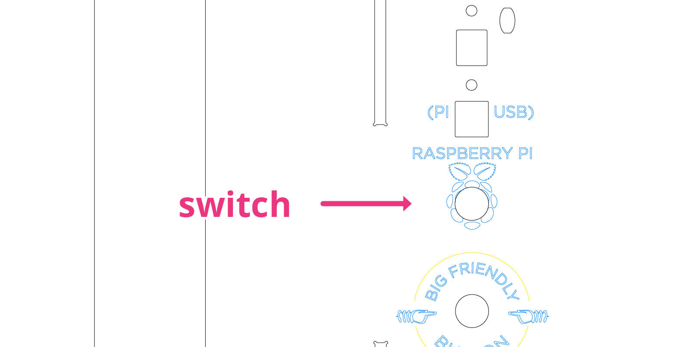
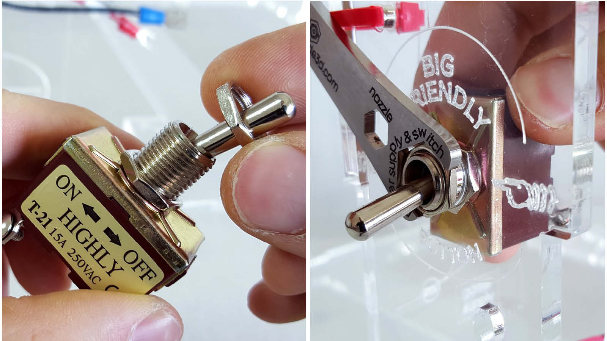
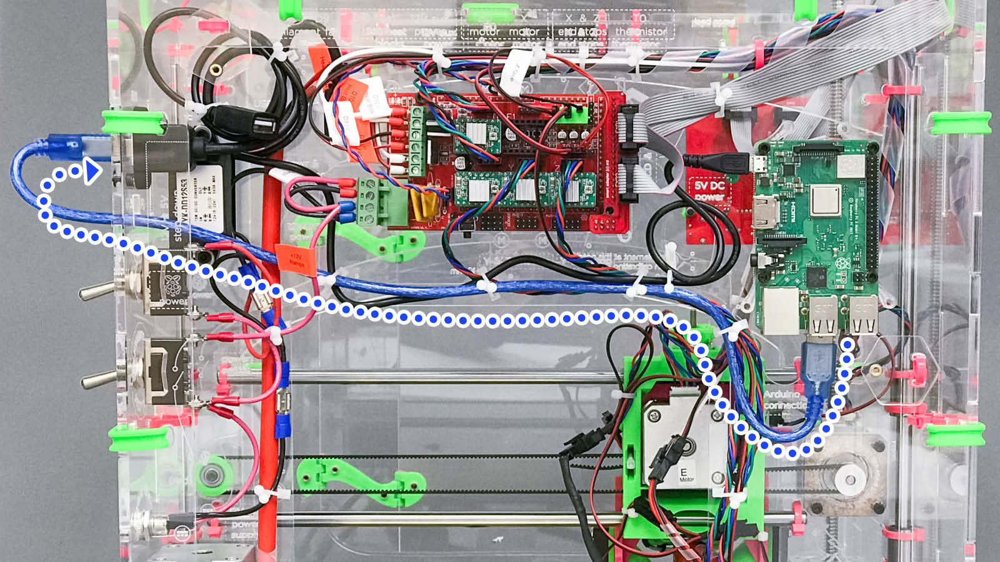

# Install the RPi Hardware Into Your JellyBox

> If you have **JellyBOX Original**, please contact `support@info.imade3d` for help with installation. This guide is for JellyBOX 2. On JellyBOX Original, you will need to drill some new holes. You can probably figure it out, but if you want a hand, write us an email. We do plan on publishing guides for JellyBOX Original as well; they are just delayed.

?> `RPi` or `Pi` are both shorthands for `Raspberry Pi`.

## What You'll Need

### Parts

If you have our [Plug and Play OctoPrint-IE KIT](https://shop.imade3d.com/3d-printer-parts-upgrades/plug-and-play-octoprint-ie-kit.html), you have all of these 👍.

- RaspberryPi 3B+
- Raspberry Pi 2 or 3 also work, but they are slower all around, and especially networking-wise. If you can, get the 3B+. It's not that expensive an it's better.
- High performwance 32GB microSD card pre-loaded with OctoPi IE (IMADE3D Edition)
    - You can buy one from us or [follow this guide to make your own](PrepareSD/Prepare_OctoPi_IE_SD_card.md).
- Lasercut spacers (4)
- 3D printed stand-offs (2)
- M3x45 sockethead screws (2)
- M3x12 sockethead screws (6)
- Either OR
    - M3 Heat inserts (6)
    - M3x16 sockethead screws (6) and M3 locknuts(6)
- M3 locknuts (2)
- USB-B cable (it's the cable that came with your JellyBOX)
- RPi JellyBOX-integrated power supply + pre-crimped wiring
- Heavy duty toggle switch + pre-crimped wiring

### Tools

- 2.5mm hex key (M3)
- IMADE3D wrench
    - A pair of pliers or locking pliers will do OK as well
- A computer and access to your local Internet

### Optional

- Soldering iron (recommended)
    - Installation is possible without a soldering iron, but you won'd be able to use the venerable brass heat insers.
- A USB webcam.
    - A few notes on webcams are in the OctoPrint [FAQ](FAQ.md).

## TL;DR For the Impatient

TL;DR? (Click to expand)

- Too Long; Didn't Read... It's a summary. It's the overtly short and possibly overly shortened text. Spark notes.

Mount the RPi on the inner back top right (there'a a space clearly prepared for it) and a step down convertor on the top left. You may need to first install a few brass heat inserts; or use longer screws and nuts. You will connect a new power switch (for the step down convertor) above the first power switch (that's there for the JellyBOX). Then you connect the JellyBOX to the RPi with a USB cable type B. That's the just of it 👍

---

## 1. Understand the Wiring

> Note: The diagrams and photos in this guide are looking from the back. So 'left' here means 'left when looking fro the back'.

### Power up the Raspberry Pi

There's the rugular JellyBOX 12V _main power supply_ that enters the JellyBOX on the bottom left (1).

This power supply is connected to the _step down convertor_ aka _RPi power supply_ (2), which steps down the voltage from 12V to 5V (which is what the RPi wants).

There's is a toggle switch (3) between the Pi (2) and the power supply (1), connected in series on the red wire. The black wire connects with the _convertor_ uninterrupted, thus completing the electrical circuit. This switch therefore controls whether the _RPi power supply_ gets any power from the _main power supply_.

Finally, a micro-USB cable coming out from the step down convertor (2) brings 5V power to the Raspberry Pi (4).

### Connect the Pi to the Control Board

To complicate matters slightly, there's still the JellyBOX RAMPS Control Board that needs power and needs to get connected to the Raspberry Pi.

It remains the same as with no Pi. The main power (1) brings power to the RAMPS board (5), interrupted by one switch (6).

Then we connect the Raspberry Pi via a USB-B cable (7) to the RAMPS board.

### The whole thing

A webcam would go into any other open USB slot on the Pi.

## 2. Mount the Raspberry Pi and the Step Down Convertor

There are two ways to mount the Pi and the convertor.

1. With brass heat inserts.
2. With nuts and screws.

The first option, heat inserts, is more elegant and it allows to mount and remount the components more easily (great for rebuilds). The downside is that you _need_ a soldering iron to to insert the _heat_ inserts.

The second option, nuts and screws... just works. It's a bit more fiddly, obviously, and the holes are too big for the screw as they are made for heat inserts, but, once its mounted, noone will notice the difference.

<!-- tabs:start -->

#### ** Option One: Heat Inserts **

### Option One: Heat Inserts

#### Install the Heat Inserts

You need to install 6 heat inserts in total. With any soldering iron, it is easy.

Here are two videos that shows nicely how heat inserts are inserted. You only need to watch watch 20 seconds from each of them (they start right at the beginning of the heat insert action).

<iframe width="560" height="315" src="https://www.youtube.com/embed/x2SYHr0kyTE?start=87" frameborder="0" allow="accelerometer; autoplay; encrypted-media; gyroscope; picture-in-picture" allowfullscreen></iframe>

<iframe width="560" height="315" src="https://www.youtube.com/embed/NXAhOEn8nXQ?start=96" frameborder="0" allow="accelerometer; autoplay; encrypted-media; gyroscope; picture-in-picture" allowfullscreen></iframe>

#### Install the Rapsberry Pi

Install the Pi using M3x12 sockethead screws (4) AND 'dogbone' acrylic spacers (4).

!> The Pi needs to be on **spacers** or there's a higher chance or worse performance due to thermal throttling.

#### Install the Step Down Convertor

Use the rest of the M3x12 screws (2).

#### ** Option Two: Nuts and Screws **

### Option Two: Nuts and Screws

#### Install the Rapsberry Pi

Install the Pi using M3x16 sockethead screws (4), M3 locknuts (4) AND 'dogbone' acrylic spacers (4).

!> The Pi needs to be on **spacers** or there's a higher chance or worse performance due to thermal throttling.

#### Install the Step Down Convertor

Use the rest of the M3x16 screws (2) and locknuts (2).

<!-- tabs:end -->

## 3. Add the Pi Switch

The process is the same as installing the power switch for the JellyBOX (hence the 'big friendly button' etchings in the photo), but you'll install the switch in the upper slot titled

### Wire Up the Switch + Convertor

If you get confused, [remember your training](#understand-the-wiring) 😈.

## 4. Connect the Pi to the RAMPS Board

## 5. (Optional) Add a USB Webcam

The webcam goes into any empty USB slot.

- A USB webcam. A few notes on webcams are in the OctoPrint [FAQ](FAQ.md).

## 6. Congrats

You're done with the hardware set up part. Have a break, and then come back for some software set up.
